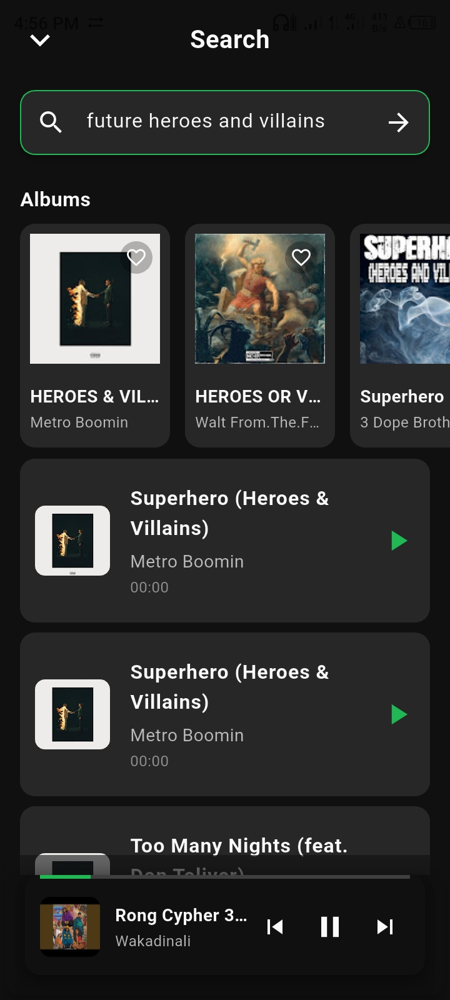
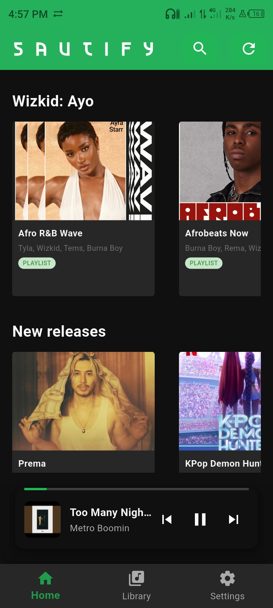

# Sautify

Stream smarter. Listen freer.
__Remember__:  `to support` [](https://buymeacoffee.com/wambugu) or [](https://www.paypal.com/ncp/payment/664ZL5XX3TKMG), .

Sautify "`Sauti`: A swahili word meaning  sound/voice" is a fast, lightweight music app designed to get you from search to sound with zero friction. Clean & minimal design, instant play, and a beautiful player that adapts to your music—so you spend less time tapping and more time listening.
> We are in early builds, so expect changes in UI/UX, addded/removed features.
> Expect uniform builds as fron `v1.0.0`, though the app is very stable as development continues. 
<p align="center">
  
  
  
  
  
  
</p>

We source  music from scraping online sources ensuring a vast library of tracks at your fingertips without the bloat of traditional apps.

## Why Sautify

- Speed first: From launch to play, everything feels instant.
- Simple by design: No clutter. The actions you need, exactly where you expect them.
- You’re in control: Play what you want—single tracks, albums, or playlists—with a smart queue that just makes sense.
- Looks as good as it sounds: A dynamic player with backgrounds that match your album art.
- Light and reliable: Small footprint, responsive UI, and smooth playback.
- Privacy focused: No accounts, no tracking, just pure listening.
- Offline mode: Download your favorite tracks and listen without internet connection.
- No tracking ads: Enjoy uninterrupted music without intrusive advertisements.
- No streaming limits: Listen to as much music as you want without restrictions.
- No strings attached: Completely free to use, no tracking, with no hidden fees or subscriptions.

## What you can do

- Search and play instantly
  Find tracks and start listening right away—no deep menus, no fuss.

- Explore playlists and albums
  Open a playlist or album and hit play, or jump straight to the song you want.

- Build your Library
  Save playlists and albums you love. Come back to favorites quickly.

- Recently Played & Favorites
  Your go‑to tracks are always just a tap away.

- Beautiful Player
  Enjoy a clean player screen.

## Availability

Sautify is built to run great on modern Android devices. iOS support is planned. Releases may be shared periodically for testing (when a new issue arises or feature request).

Report the issues you encounter or suggest features on the [GitHub Issues page](https://github.com/wambugu/sautify/issues).
Though stable releases are prioritized, beta versions may be shared for testing new features until we reach `v1.0.0`. Expect a consistent stream of updates and improvements.

## Privacy

Sautify is designed with a user‑first mindset. It avoids unnecessary data collection and respects your listening.
No login or account is required to use Sautify. Your data stays on your device: if you clear the app's data, your preferences will be reset.

## Feedback

Have an idea, found a bug, or want to shape what comes next? Open an issue or share feedback—your input helps Sautify stay fast, focused, and delightful.

## Known Issues

- Lyrics may not always sync perfectly with the music or they may be unavailable or even wrong.
- Slow network connections can lead to delays in loading music or lyrics—that's obvious.

## Contributing

We welcome contributions to Sautify! Whether it's reporting bugs, suggesting features, or submitting code changes, your input is valuable.

### How to Contribute

1. __Report Issues__: If you encounter a bug or have a feature request, please open an issue on our GitHub repository.
2. __Code Contributions__: If you'd like to contribute code:
   - Fork the repository.
   - Create a new branch for your feature or bug fix.
   - Make your changes and commit them with clear messages.
   - Submit a pull request for review.
3. __Review Process__: All contributions will be reviewed by the maintainers. Please be patient as we ensure quality and consistency.

> `Leave a star 🌟` if you like Sautify!

— Enjoy the music.

# Legal Disclaimer

```
Sautify does not possess or maintain any association with the songs and other content accessible through the app.
All songs and other content are the property of their respective owners and are safeguarded by copyright law.
Sautify holds no liability for any copyright infringement or other violations of intellectual property rights
that may arise from the use of the songs and other content accessible through the app.
Sautify employs third-party plugins and assumes no responsibility for any harm or damage to the respective owners or
any other parties resulting from the utilization of the songs and other content through the third-party plugins.
By using the app, you consent to utilizing the songs and other content exclusively for personal,
non-commercial purposes and in accordance with all applicable laws and regulations.
```
